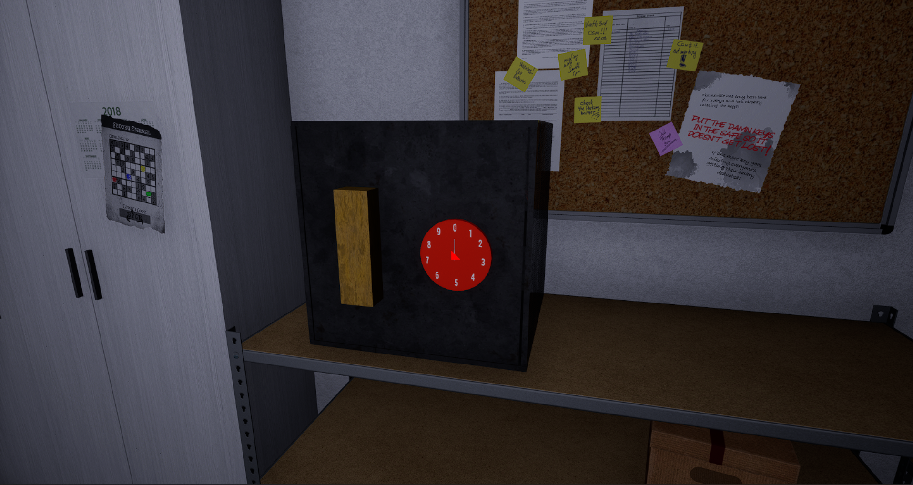
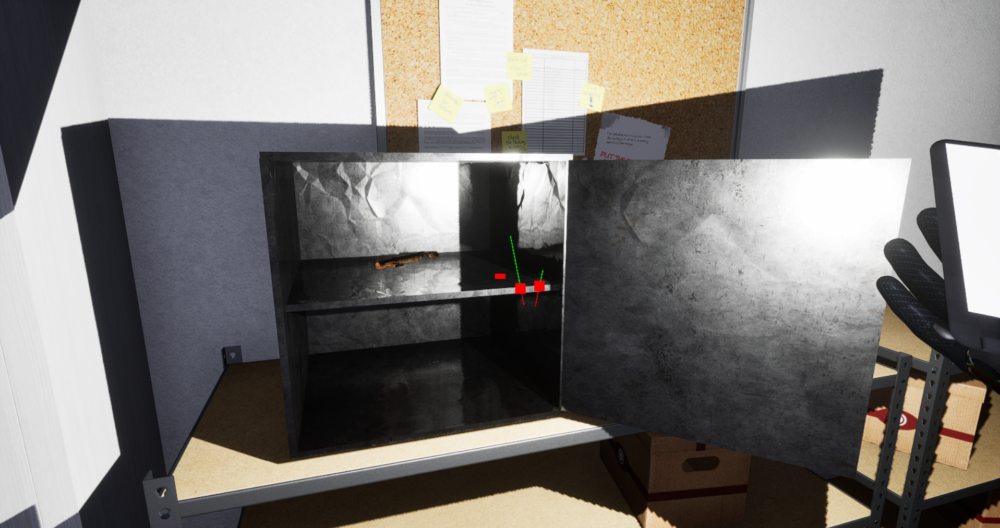
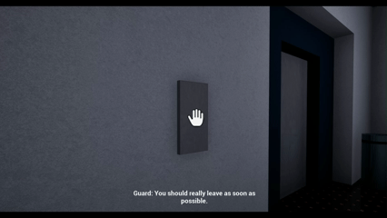
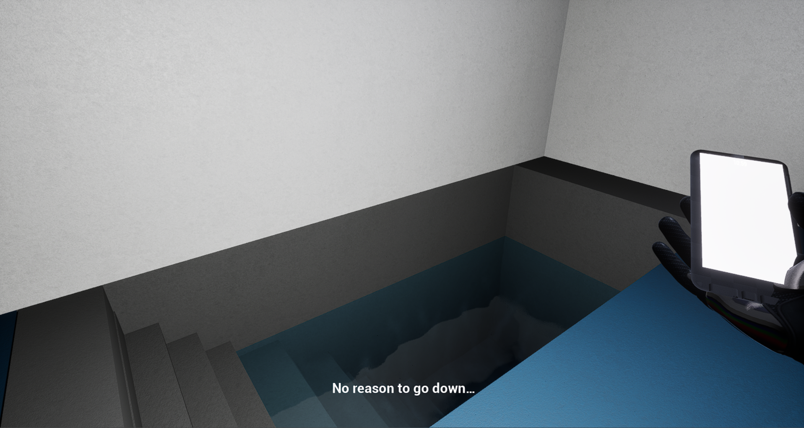

# FYP - Game Systems Prototype
Developed gameplay systems prototype featuring safe vault puzzles, door mechanics, game gating and interactive logic using Unreal Engine 5 Blueprints.

---

## Overview 
This project was a 6 month prototype developed as part of my final year project. Focused on creating functional gameplay systems and mechanics for a small-scale game prototype.

---

## Challenges
- Designing a safe vault puzzle with rotation mechanics, password checking and anti-spam logic
- Implementing doors and game gating systems with proper logic flow
- Managing multiple small systems and interactive effects under time and resource constraints

---

## Features 
- Safe vault puzzle system with rotation locks and password validation
- Door mechanics with locked/unlocked states
- Game gating logic to control player progression
- Various small interactive systems: invisible walls, locked doors and environment triggers
- Blueprint-based implementation in Unreal Engine 5

---

## Tech Stack
- Unreal Engine 5
- Blueprint scripting

---

## Media
- Safe Lock Puzzle

- Pump Puzzle

- Gating Game Systems

